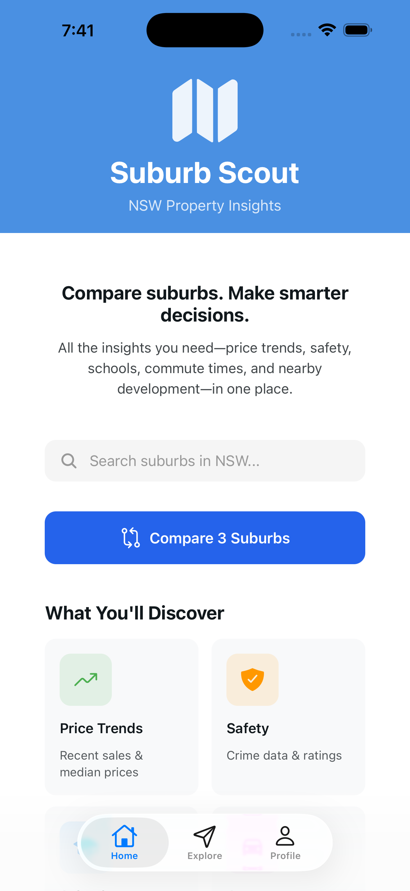

# Suburb Scout — NSW Property Insights (React Native)




One map-first mobile app for NSW buyers and renters to compare suburbs on price trends, safety, schools, commute, and development activity—with smart alerts for nearby Development Applications (DAs).

## 🎯 Why This App?
Finding a place to live in NSW currently means piecing together information from dozens of different sites:

📊 Recent sales data and price trends

🚨 Crime statistics and safety trends

🏫 School zones and performance data

🚆 Commute times and transport options

🏞️ Flood zones and elevation data

🏗️ Development applications and construction activity

** Suburb Scout brings all these high-signal indicators into a single, fast, mobile-first experience you can actually use during property inspections. ** 


## ✨ Core Value Proposition
Compare Suburbs in Seconds
Side-by-side comparison of up to 3 suburbs using consistent, trusted indicators

Quick scoring system for easy assessment

Historical trend data for informed decision-making

### 🔔 **Smart DA Alerts**
- **"New DA within 500m of your saved property"**
- **"Major development approved in Blacktown"**
- **"Heritage restriction lifted in Glebe"**

### 📊 **Trusted Indicators**
- **Price Data** - CoreLogic, NSW Valuer General
- **School Performance** - My School, ACARA
- **Crime Statistics** - BOCSAR, NSW Police
- **Development Applications** - NSW Planning Portal
- **Flood & Elevation** - NSW Spatial Services

## 🎯 Use Cases

### 🏠 **For Buyers**
> "Compared 3 suburbs during an open house, discovered Surry Hills had 40% fewer development applications than Redfern - less future construction disruption"

### 🏡 **For Renters**
> "Set up DA alerts for my current area, got notified about a new 200-unit complex being approved - know my rent might stabilize due to increased supply"

### 👨‍💼 **For Investors**
> "Overlayed school zones with price growth data, identified undervalued areas with top-tier school catchments"


## 🛠️ Technical Stack

```yaml
Frontend: React Native + TypeScript
Maps: Mapbox GL Native
Backend: Node.js + PostgreSQL
Notifications: Firebase Cloud Messaging
Data: NSW Government APIs, Custom ETL Pipelines
Hosting: AWS EC2 + RDS (Plan)